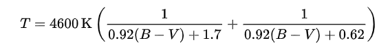
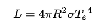
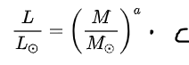

# Design document
## Michael Stroet - 11293284

<!--
Based on your proposal, you can now start studying your problem in a more technical fashion. Map the separate parts of the solution onto the framework(s) that you are using. What APIs, methods or techniques do you need to implement each feature?

Think about and fully express how the user interface will be handled, where the data is coming from, and how the various parts will work together to form a complete application.

The teaching staff and your fellow students can help you spot fundamental problems that need to be solved, or if technical limitations will likely prevent you from finishing the project.

Design doc for data visualizations
    For this deadline, you must prove that you have access to the data in a usable format!

    Some parts that you should describe here:

    a list of data sources if you will get data from an external source, including information on how your are going to filter and transform the data for your project

    a diagram with an overview of the technical components of your app (visualizations, scraper etc etc)

    as well as descriptions of each of the components and what you need to implement these

    a list of APIs or D3 plugins that you will be using to provide functionality in your app
-->
### Dataset
Voor het project wordt er gebruik gemaakt van de [HYG-database](https://github.com/astronexus/HYG-Database) van David Nash. Deze database bevat 119.616 sterren en is samengesteld uit drie verschillende catalogussen:
- Hipparcos Catalog
- Yale Bright Star Catalog (5th edition)
- Gliese Catalog of Nearby Stars (3rd edition)

In deze database is voor elke ster, waar mogelijk, een groot aantal informatie en eigenschappen beschikbaar. Voor de visualisatie worden vier van deze eigenschappen gebruikt:
- proper (proper name): De naam van een bekende ster zoals Sol, Polaris, Sirius, etc.
    - 146 (0,12%) van de sterren hebben een proper name
- dist (distance): De afstand van de zon tot de ster in parsec (~3*10^16 meter)
    - 109.399 (91,5%) van de sterren hebben een afsand
- ci (color index): De (B-V) kleurenindex van een ster.
    - 117.732 (98,4%) van de sterren hebben een kleurenindex
- lum (luminosity): De lichtkracht van de ster relatief aan de zon
    - 119.616 (100%) van de sterren hebben een lichtkracht

Van de kleurenindex kan de effectieve temperatuur bepaald worden door middel van de formule van Ballesteros \[[1](README>md/#referenties)\]:

,

met T de effectieve temperatuur en (B-V) de kleurenindex.

Van de lichtkracht kan de straal van de ster bepaald worden door middel van de wet van Stefan-Boltzmann:

,

met L de totale lichtkracht, R de straal, σ de constante van Stefan-Boltzmann en Te de effectieve temperatuur.

Met de temperatuur en de lichtkracht kan het Hertzsprung-Russell diagram gemaakt worden, waaruit de grenzen van de verschillende categoriën bepaald kan worden en elke ster aan één van deze kan worden toegewezen.

Met de lichtkracht en de categoriën kunnen de massa's van de sterren bepaald worden met behulp van de massa-lichtkracht relatie. Deze relatie is anders voor elke categorie.

,

met L/Lo de lichtkracht relatief aan de zon, M/Mo de massa relatief aan de zon en a en c twee constantes die afhankelijk zijn van de categorie.
De waardes van deze constanten zullen uit Zaninetti (2008) \[[2](README>md/#referenties)\] gehaald worden.
