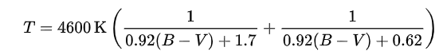
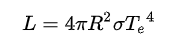
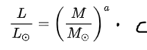

# Design document
### Michael Stroet - 11293284

## Dataset
Voor het project wordt er gebruik gemaakt van de [HYG-database v.3](https://github.com/astronexus/HYG-Database) van David Nash. Deze database bevat 119.616 sterren en is samengesteld uit drie verschillende catalogussen:
- Hipparcos Catalog
- Yale Bright Star Catalog (5th edition)
- Gliese Catalog of Nearby Stars (3rd edition)

In deze database is voor elke ster, waar mogelijk, een groot aantal informatie en eigenschappen beschikbaar. Voor de visualisatie worden vier van deze eigenschappen gebruikt:
- proper (proper name): De naam van een bekende ster zoals Sol, Polaris, Sirius, etc.
    - 146 (0,12%) van de sterren hebben een proper name
- dist (distance): De afstand van de zon tot de ster in parsec (~3*10^16 meter)
    - 109.399 (91,5%) van de sterren hebben een afsand
- ci (color index): De (B-V) kleurenindex van een ster.
    - 117.732 (98,4%) van de sterren hebben een kleurenindex
- lum (luminosity): De lichtkracht van de ster relatief aan de zon
    - 119.616 (100%) van de sterren hebben een lichtkracht

Van de kleurenindex kan de effectieve temperatuur bepaald worden door middel van de formule van Ballesteros \[[1](README.md/#referenties)\]:

,

met T de effectieve temperatuur en (B-V) de kleurenindex.

Van de lichtkracht kan de straal van de ster bepaald worden door middel van de wet van Stefan-Boltzmann:

,

met L de totale lichtkracht, R de straal, σ de constante van Stefan-Boltzmann en Te de effectieve temperatuur.

Met de temperatuur en de lichtkracht kan het Hertzsprung-Russell diagram gemaakt worden, waaruit de grenzen van de verschillende categoriën bepaald kan worden en elke ster aan één van deze kan worden toegewezen.

Met de lichtkracht en de categoriën kunnen de massa's van de sterren bepaald worden met behulp van de massa-lichtkracht relatie. Deze relatie is anders voor elke categorie.

,

met L/Lo de lichtkracht relatief aan de zon, M/Mo de massa relatief aan de zon en a en c twee constantes die afhankelijk zijn van de categorie.
De waardes van deze constanten zullen uit Zaninetti (2008) \[[2](README.md/#referenties)\] gehaald worden.

Nadat alle data is geïsoleerd en berekent is in python zal deze in een JSON bestand worden opgeslagen. De structuur van dit bestand is als volgt:
{

    "Rode dwergen": {

        Ster 1 (proper name of andere identificatie): {

            temperatuur: a,

            helderheid : b,

            kleur : c,

            massa : d,

            straal : e,

            afstand : f

            },

        Ster 2: {},

        ...},

    "Hoofdreeks": {},

    ...    

}

### Opmerkingen

Om aan elke temperatuur een kleur toe te kunnen wijzen, wordt er gebruik gemaakt van een [blackbody color tabel](http://www.vendian.org/mncharity/dir3/blackbody/UnstableURLs/bbr_color.html). Van de twee verschillende Color Matching Functions (CMF) zullen de CIE 1931 waardes gebruikt worden.

## Visualisatie

### Initialisatie
Wanneer de visualisatie voor het eerst wordt geopend, bevatten de taartdiagram en histogrammen alle sterren. In het HR-diagram wordt de zon geselecteerd. De corresponderende balken in de histogrammen en de "Hoofdreeks" sectie van de taartdiagram worden gehighlight.

### Updates

Ieder figuur beïnvloed de andere figuren, of door dingen te highlighten of door ze te updaten.

#### Hertzsprung-Russell diagram

In het HR-diagram kunnen individuele sterren worden geselecteerd. Wanneer een bepaalde ster wordt geselecteerd verschijnt rechts naast het diagram de indentificatie/naam van de ster en zijn eigenschappen. Verder worden in de taartdiagram en histogrammen de bijbehoordende data gehighlight.

Boven het HR-diagram staat een dropdown menu waarin de sterren met een proper name kunnen worden geselecteerd zonder dat deze in het diagram gezocht hoeven te worden.

Naast het diagram komt ook een afstandsslider die alle figuren aanpast zodat zij alleen sterren laten zien die tot een bepaalde afstand staan. De beginwaarde van deze slider moet nog bepaald worden.

#### Taartdiagram

In het taartdiagram kan op de verschillende categoriën geklikt worden. Wanneer een categorie geselecteerd is worden de histogrammen aangepast zodat alleen de sterren uit die categorie zichtbaar zijn. In het HR-diagram worden de corresponderende sterren gehighlight en de rest gedimd.

#### Histogram: temperatuur

In dit histogram kunnen de balken aangeklikt worden. Wanneer een bepaalde temperatuur range wordt geselecteerd, worden het andere histogram en het taartdiagram aangepast zodat zij alleen sterren met die temperatuur weergeven. In het HR-diagram worden deze gehighlight en de rest gedimd.

#### Histogram: massa/straal

In dit histogram kunnen ook de balken aangeklikt worden, maar deze bevat nu ook twee knoppen waarmee het histogram van variabele kan veranderen. Wanneer een bepaalde massa of straal range wordt geselecteerd, worden het andere histogram en het taartdiagram aangepast zodat zij alleen sterren in dat gebied weergeven. In het HR-diagram worden deze gehighlight en de rest gedimd.

#### Combinatie

Het huidige plan is dat deze updates op elkaar gestapeld kunnen worden. Als de "Superreuzen" in het taartdiagram geselecteerd zijn, kunnen in de aangepaste histogrammen verder op de balken geklikt worden. Deze passen dan de overige figuren verder aan.

In dit geval is het niet nuttig meer dat de histogrammen het taartdiagram aanpassen, omdat dat diagram dan maar 1 categorie met 100% heeft.

Door op een geselecteerde optie opnieuw te klikken wordt deze gedeselecteerd.

## Externe componenten

In dit project zal gebruik worden gemaakt van [D3 v5](https://github.com/d3/d3) en de [d3-tip](https://github.com/Caged/d3-tip) library voor tooltips.

Voor een mooie indeling van de website zal [bootstrap v3.4.1](https://getbootstrap.com/) gebruikt worden.
