# Process book 2019
### Michael Stroet - 11293284

## Maandoverzicht
Week: [1](#week-1-3-9-juni) - [2](#week-2-10-16-juni) - [3](#week-3-17-23-juni) - [4](#week-4-24-30-juni)

## Week 1 (3-9 juni)

### Weekoverzicht
Dag: [1](#dag-1) - [2](#dag-2) - [3](#dag-3) - [4](#dag-4) - [5](#dag-5)
### Dag 1:

#### Projectvoorstel
Voor het project heb ik gekozen voor 1 scatterplot, 1 taartdiagram en 2 histogrammen. In het [projectvoorstel](PROPOSAL.md) is deze schets te vinden:

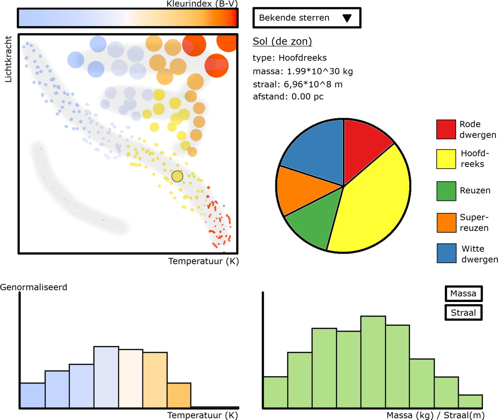

### Dag 2:

#### Design document
In het [design document](DESIGN.md) staat beschreven welke dataset ik gebruik en hoe ik deze zal gebruiken. Verder wordt uitgebreid beschreven hoe de figuren elkaar onderling beïnvloeden.

#### mentorgesprek
Aan de hand van het mentorgesprek met Jasper zal er ook een afstandsslider toe worden gevoegd bij het HR-diagram. Deze zorgt ervoor dat het HR-diagram iets levendiger wordt.

### Dag 3:

#### Stand-up
Met twee van de vier mensen aanwezig waren we snel klaar met de eerste standup meeting. Er was niets aan te merken over mijn verhaal of mijn plan. Ik kreeg echter wel de tip om polygonen te gebruiken voor het bepalen van de categoriën.

#### Geschreven code

##### Python
- create_temperatureCSV.py geschreven die de data in een pandas dataframe zet. De data wordt geïsoleert en de sterren met ontbrekende gegevens verwijdert. De waardes van de effectieve temperaturen worden berekent in calculate_temperature.py en deze worden als extra kolom toegevoegd aan de dataframe. Deze dataframe creëert een nieuwe csv: [temperature.csv](data/temperature.csv).
- [Script](code/python/plot_Hertzsprung-Russell.py) geschreven die een Hertzsprung-Russell diagram plot met matplotlib.

#### Keuzes categorie grenzen
Het resulteerende figuur:

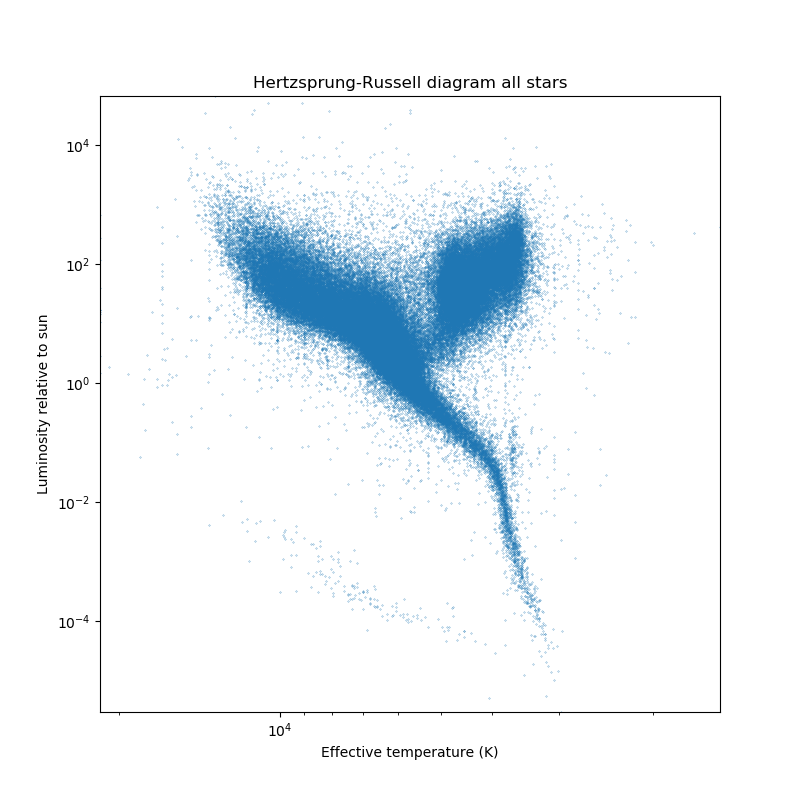

Hieruit zijn de grenzen van de verschillende gebieden bepaald:

De coördinaten van de hoekpunten van elk polynoom zijn genoteerd en opgeslagen in [polygon_points.csv](data/polygon_points.csv).

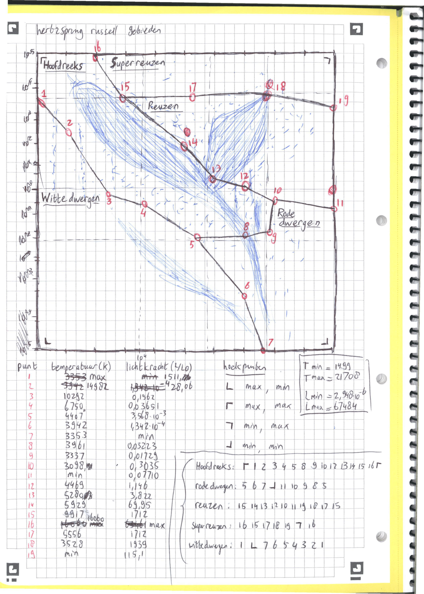

### Dag 4:

#### Stand-up
Tijdens de stand-up meeting van vandaag werd mij aangeraden om even te stoppen met de data te bewerken en om van random data alvast figuren te maken.

Verder werd er opgemerkt over het python HR-diagram dat door zo'n groot aantal sterren het één grote vlek is. Een mogelijke oplossing hiervoor is de afstandslider niet op maximaal te initialiseren en de mogelijkheid voor een minimum afstand.

#### Geschreven code

##### Python
- Begonnen aan het bepalen van de polygonen coördinaten in het [plot_HR bestand](code/python/plot_Hertzsprung-Russell.py).
- add_category_color_radius_mass.py aangemaakt die alle variabelen, op het moment random, toevoegt aan de [temperature csv](data/temperature.csv) en daarmee [stars.csv](data/stars.csv) aanmaakt.
- Begonnen aan het convertCSV2JSON.py script die de data om zal zetten naar json bestanden.

De python code is op het moment vrij rommelig, later zal er een hoofdbestand komen die alles in één keer zal laten runnen.

##### HTML / CSS
- [Html](code/html-css/stars.html) en [css](code/html-css/stars.css) bestanden van de visualisatie pagina aangmeaakt. De html pagina maakt gebruik van een bootstrap indeling. Link naar de visualisatie toegevoegd aan het [index.html](index.html) bestand.

##### Javascript
- [Hoofdbestand](code/javascript/stars.js) voor javascript aangemaakt die de json data inlaad en de pagina klaarmaakt voor de figuren.
- [Scatterplot script](code/javascript/starsScatterplot.js) aangemaakt die een Hertzsprung-Russell diagram maakt van de sterren. De huidige versie plot alleen de sterren met een proper naam.
- [Piechart script](code/javascript/starsScatterplot.js) aangemaakt die een taartdiagram maakt van de verschillende soorten sterren. In het diagram staat alleen dummy data op het moment

#### Figuren
De huidige Hertzsprung-Russell en taart- diagrammen in de visualisatie:

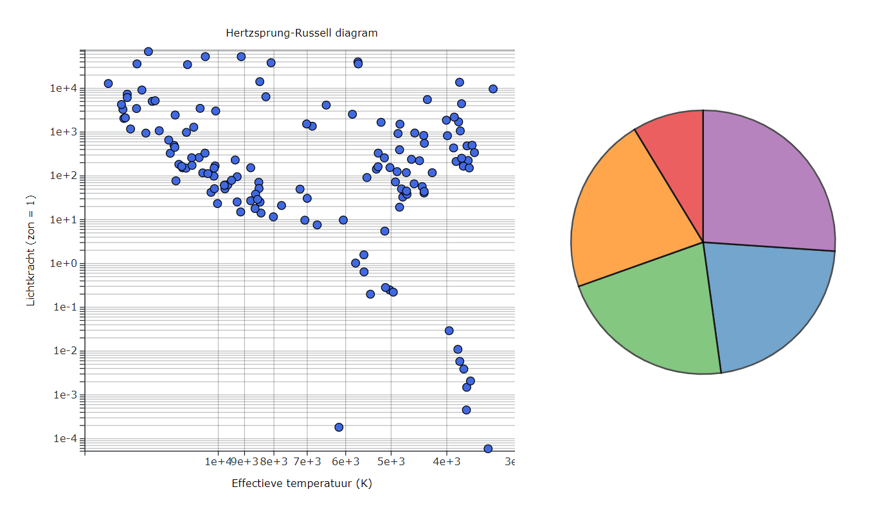

### Dag 5:

#### Stand-up
De eerste stand-up waar iedereen aanwezig was. Volgens het team ziet mijn prototype er goed uit, met een kleine aanmerking over de grid van het HR-diagram. Omdat de y-as logaritmisch is verschijnen er veel lijnen dicht op elkaar.

#### Geschreven code

##### HTML / CSS
- Nieuwe javascript bestanden toegevoegd aan [stars.html](code/html-css/stars.html). Het defineren van een "div" voor de verschillende tooltips staat nu in een functie.

##### Javascript
- Het [taartdiagram script](code/javascript/starsPiechart.js) aangepast zodat het de [stars.json](data/stars.json) data gebruikt.
- Code voor de twee histogrammen geschreven:
    - Het [temperatuur script](code/javascript/starsTemperatureHist.js) maakt een histogram van de sterren gebaseerd op hun temperatuur. De x-as is hetzelfde als die van het HR-diagram. De waardes van het histogram komen uit [stars.json](data/stars.json).
    - Het [massa/straal script](code/javascript/starsMassRadiusHist.js) maakt een histogram van de sterren gebaseerd op hun straal. Massa is nog niet geïmplementeerd. De waardes komen ook uit [stars.json](data/stars.json).
- Het dropdown menu van proper namen heeft staat nu in een eigen [script](code/javascript/starsProperDropdown.js). De opties komen van de [stars.json](data/stars.json) keys, dus in de toekomst moet er een starsProper.json komen wanneer meerdere sterren zullen worden gepbruikt.
- Een [bestand](code/javascript/starsDistanceSlider.js) aangemaakt voor de afstand slider.

#### Huidige visualisatie

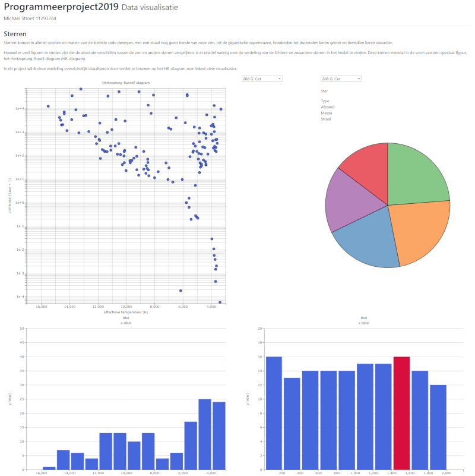

## Week 2 (10-16 juni)

### Weekoverzicht
Dag: [6](#dag-6) - [7](#dag-7) - [8](#dag-8) - [9](#dag-9) - [10](#dag-10)

### Dag 6:

#### Stand-up
Pinksteren: geen stand-up

##### Python
- Python code en structuur opgeschoond. Er is nu één hoofdbestand (main.py) die de hyg data inlaad en omzet naar een json bestand.
- Elke toevoeging aan de dataframe in main staat in zijn eigen bestand: add_temperature.py, add_radius.py en add_type.py
- get_polygons.py is een tijdelijke code die de twee polygon tekst bestanden omzet naar een dictionary van polygonen met coördinaten.

#### Figuren
De Hertzsprung-Russell en taart- diagrammen met data. Hier zijn alleen de sterren met een proper naam te zien:
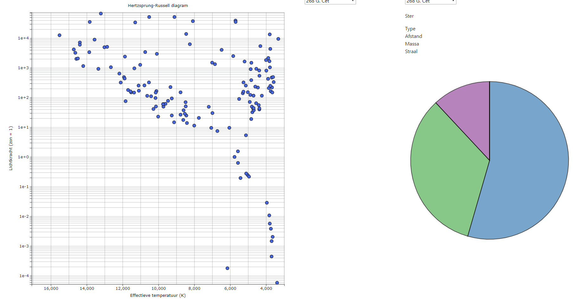

Hier is dezelfde visualisatie, maar dan met alle 100.000+ sterren:
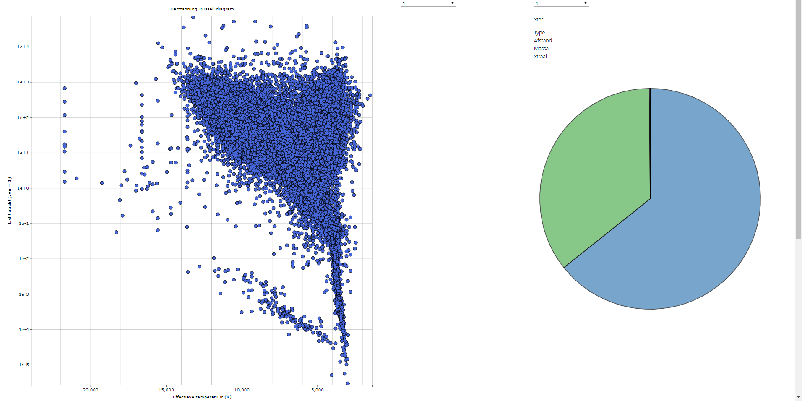

Het aantal hoofdreeks en reuzen sterren is duidelijk vele malen groter dan het aantal rode/witte dwergen en superreuzen. Om het taartdiagram toch nog interactief te maken zal er ook op de uiteindelijke legenda geklikt moeten kunnen worden.

### Dag 7:

#### Stand-up
Deze week wil ik voornamelijk besteden aan het updaten van de figuren. Er werd een opmerking gemaakt over de piechart en de ontbrekende taartpunten. Deze bleken echter te missen vanwege een bug in de piechart code.

#### Geschreven code

##### Python
- main.py heeft nu een globale boolean PROPER_ONLY. Afhankelijk van deze boolean worden alleen de sterren met een proper naam omgezet naar een json (properStars.json) bestand, of alle sterren (stars.json).

##### Javascript
- Afstandsslider gemaakt met behulp van de [d3-simple-slider](https://github.com/johnwalley/d3-simple-slider) externe library.
- Bug in de piechart gefixed waardoor er twee taartpunten ontbraken. (Rode dwergen =/= Rode_dwergen)
- Functies voor minimale en maximale waardes in een eigen bestand gezet.
- Aanpassingen gemaakt aan het uiterlijk van de histogrammen.

##### HTML / CSS
- Paginastructuur aangepast voor de slider

#### Huidige visualisatie

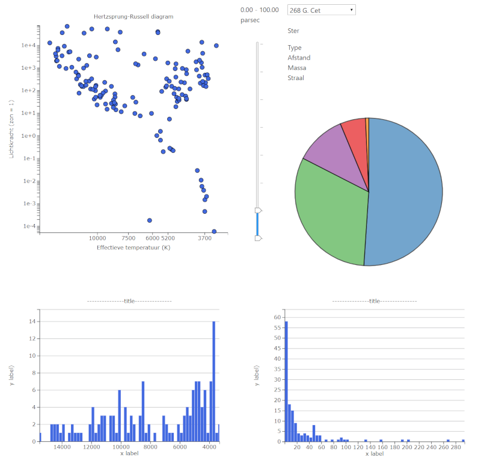

### Dag 8:

#### Stand-up
Style guide laten we voor morgen, aangezien één van de leden niet aanwezig was.
Er werd gesproken ovr het inplementeren van een schaal functie voor de grootte van de HR-diagram punten, inplaats van een wortel.

#### Geschreven code

##### Python
- Een aantal punten van de polygonen verplaatst en main.py opnieuw gedraaid.

##### Javascript
- Labels en titels toegevoegd aan de histogrammen.
- Tooltips en klikbare toevoegingen voor de figuren.
- HR-diagram sterren hebben verschillende groottes, bepaald uit de derde-machts wortel van de straal in zonsstralen
- De afstandsslider update het taartdiagram.

##### HTML / CSS
- tooltips.css aangmeaakt voor de tooltip styles
- Verhoudingen van de slider en dropdown/info/taartdiagram kolommen aangepast

#### Figuren

De nieuwe polygonen geplot in het scatterplot in python:

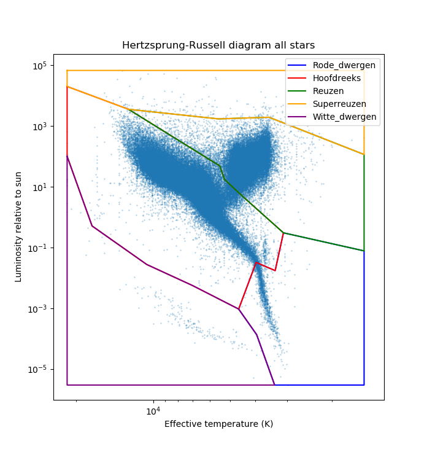

Het met de slider geüpdate taartdiagram:

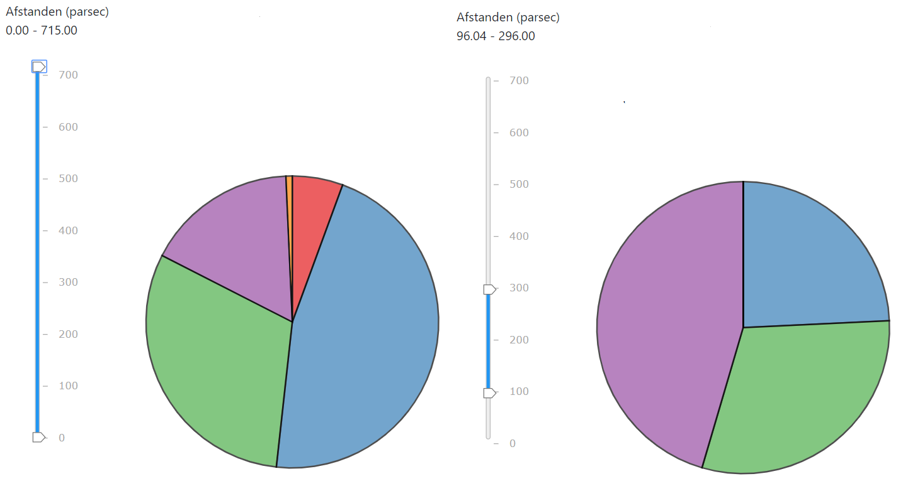

#### Huidige visualisatie

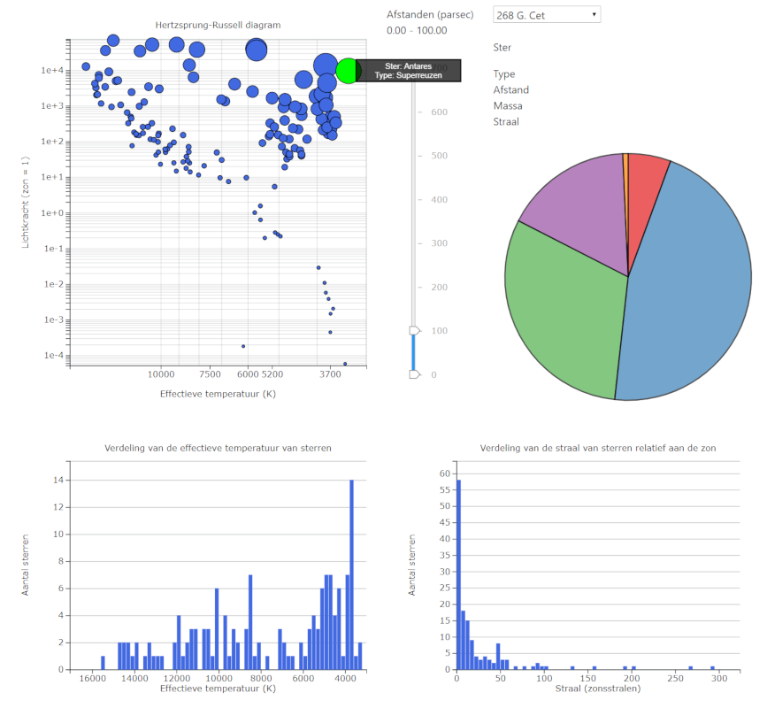

### Dag 9:

#### Stand-up
Twee mensen niet aanwezig, geen stand-up.

#### Geschreven code

##### Javascript
- Legenda gemaakt voor het taartdiagram
- Afstandsslider update het HR-diagram door sterren buiten de afstandsrange een straal van 0 te geven.
- Start gemaakt aan het updaten van de massa/straal histogram met de afstandsslider. De assen worden aangepast naar de nieuwe data, de balken nog niet.

### Dag 10:

#### Stand-up
Same as usual.

#### Geschreven code

##### Python
- Polygon punt 15 verplaatst, nieuwe json bestanden gegenereerd.

##### Javascript
- Klikken op een ster of een ster selecteren uit het dropdown menu geven de eigenschappen van de ster weer boven het taartdiagram.
- Het indelen van data in histogram bins in een eigen functie gezet voor elk histogram.
- De Afstandsslider update de twee histogrammen met een mooie transition, temperatuur bins zijn nog een beetje buggy.

##### HTML / CSS
- tooltips.css verwijderd en alleen het .toolip deel verplaatst naar stars.css. .tooltip#id in had geen effect en bleek uberhaupt niet nodig.

#### Figuren

De huidige visualisatie voor alle afstanden:

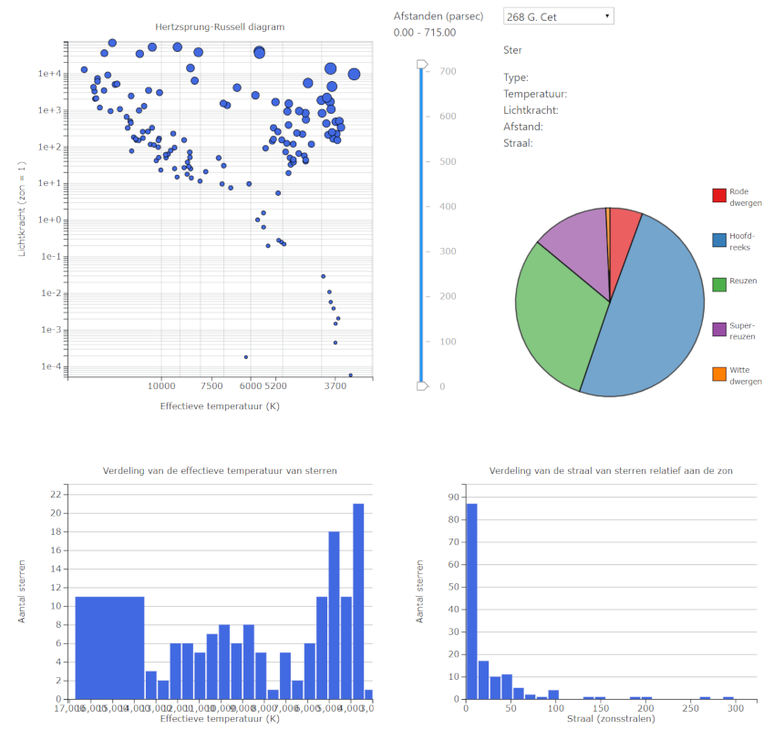

De visualisatie van 100 tot 500 parsec (Waarschijnlijk een goed idee om parsec om te zetten naar lichtjaren. (1 parsec ~ 3.26 lichtjaar)):

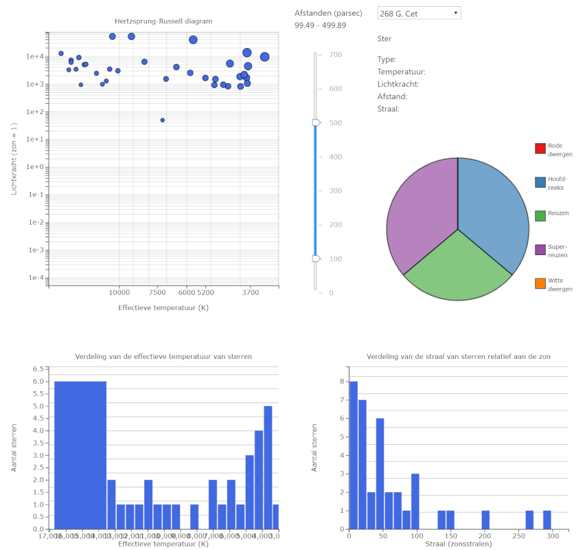

## Week 3 (17-23 juni)

### Weekoverzicht
Dag: [11](#dag-11) - [12](#dag-12) - [13](#dag-13) - [14](#dag-14) - [14](#dag-14) - [weekend](#weekend-3)

## Dag 11:

#### Stand-up
Het plan voor deze week is om alle functionaliteit af te maken. Alle figuren moeten geselecteerd kunnen worden en elkaar updaten. Verder moeten de twee json bestanden ingeladen worden en er moet tussen gewisseld kunnen worden.

Met extra tijd wil ik graag de kleuren toevoegen en het taartdiagram dynamisch laten updatem.

#### Geschreven code

##### Markdown
- STYLE.md geschreven. Beter laat dan nooit.

##### Javascript
- Vier globale variabelen gemaakt die de originele datasets onthouden, de selecties bijhouden en de duur van een update transitie vastleggen.
- De dataset verwerker in het slider bestand verplaatst naar een eigen bestand en selecteerd nu gebaseerd op afstand, temperatuur, type en straal.
- De updateGraphs functie in het slider bestand uitgebreid en verplaatst naar het hoofd javascript bestand stars.js.
- Alle figuren roepen bovenstaande functie aan en updaten elkaar!
- Reset knop voor de selecties toegevoegd in de lege hoek rechts boven. Plus een plaats voor tekst om de selecties weer te geven.
- Twee niet werkende radio knoppen toegevoegd voor het selecteren van de dataset.

#### Huidige visualisatie

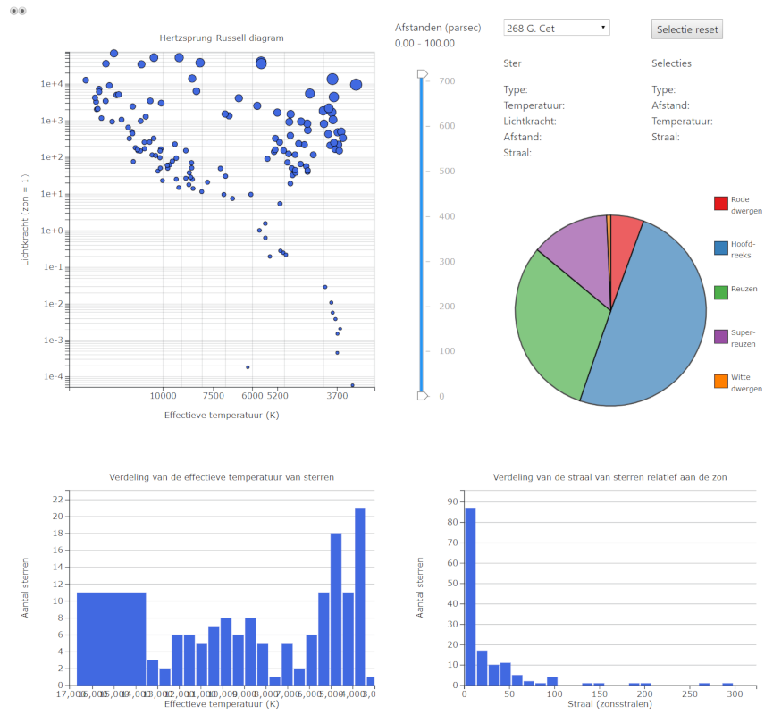

## Dag 12:

#### Stand-up
Surprise, surprise, geen stand-up.

#### Gechreven code

##### Javascript
- HR-diagram gebruikt nu het enter, update, exit patroon. Een geklikte ster wordt gehighlight.
- Bugs in de histogrammen gefixed. Bins in de temperatuur histogram en de thresholds in de straal histogram.

#### Huidige visualisatie

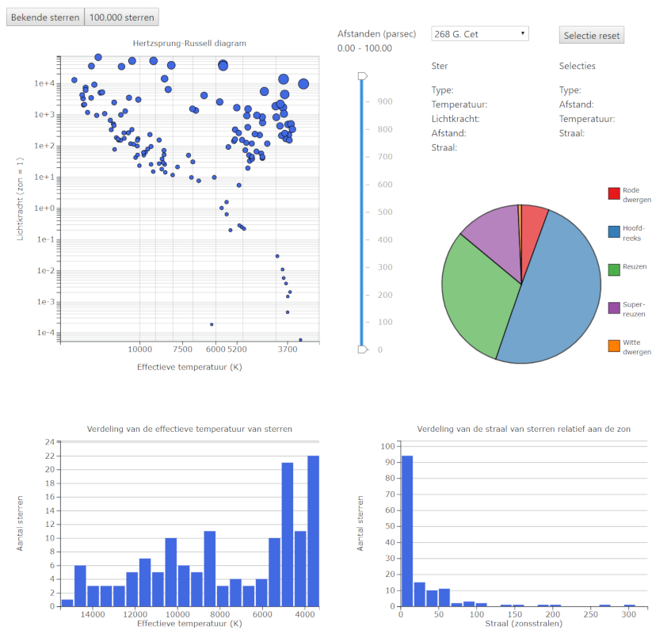

## Dag 13:

## Dag 14:

### Dag 5:

### Weekend 3:

## Week 4 (24-30 juni)

### Weekoverzicht
Dag: [16](#dag-16) - [7](#dag-7) - [18](#dag-18) - [19](#dag-19) - [20](#dag-20) - [weekend](#weekend-4)

## Dag 16:

## Dag 17:

## Dag 18:

## Dag 19:

## Dag 20:

### Weekend 4:
