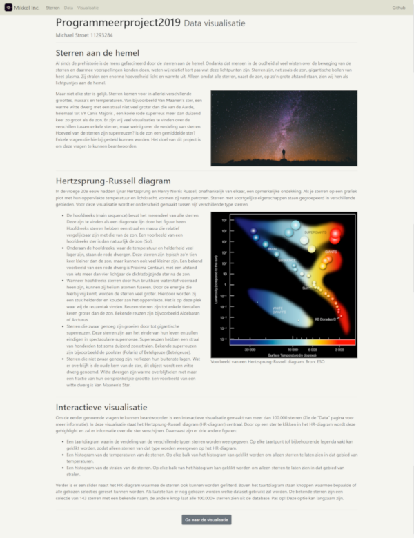
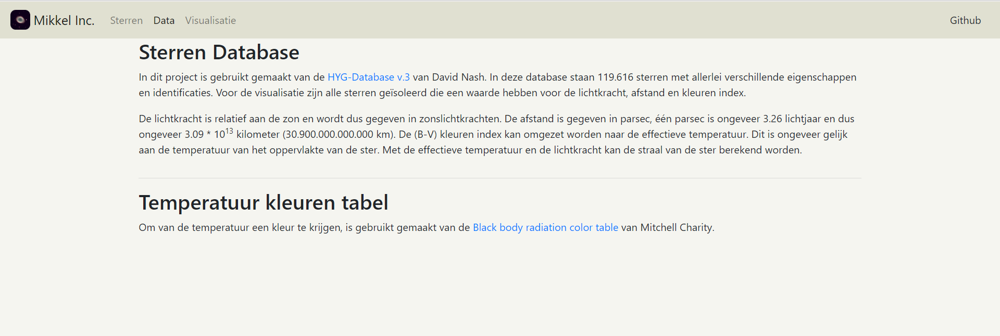
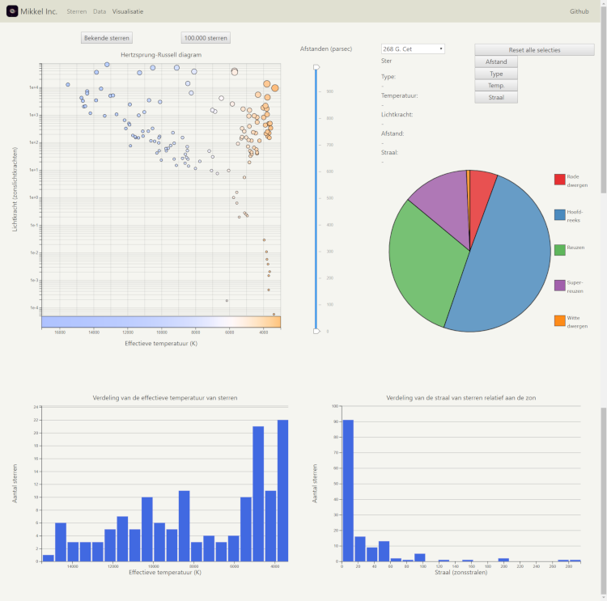
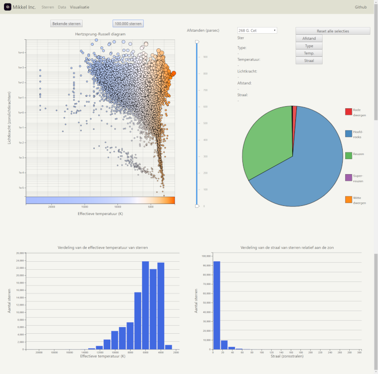

# Verdeling van sterren op het Hertzsprung-Russell diagram
### Programmeerproject2019
#### Michael Stroet - 11293284
UvA minor programmeren 2019
ProgrammeerProject periode 6 (5062PRPR6Y)

## Eindproduct

##### Github pages
[Visualisatie sterren](https://michaelstroet.github.io/Programmeerproject2019/code/html-css/stars.html)

##### Product video
[Unavailable](https://www.youtube.com/watch?v=dQw4w9WgXcQ)

##### Final report
[Final report](https://michaelstroet.github.io/Programmeerproject2019/REPORT.md)

## Doel
In dit project heb ik een visualisatie gemaakt waarmee de verdeling van de verschillende soorten sterren om ons heen wordt weergeven. Omdat er veel meer te vinden is over de vergelijking van individuele sterren, vult dit een gat in de kennis over sterren van mensen buiten de natuur- en sterrenkunde.

## Website
Wanneer gebruikers naar de pagina navigeren zullen zij als eerste de "Sterren" pagina zien. Op deze pagina wordt het onderwerp geïntroduceerd, het Hertzsprung-Russell en uitgelegd hoe de visualisatie er uit zal zien en hoe deze gebruikt moet worden.

Voor de gebruiker naar de visualisatie gaat, kan de data pagina ook nog bekeken worden.

Eenmaal bij de visualisatie aangekomen ziet de gebruiker deze pagina:

Hier kan de gebruiken selecties maken uit ster afstand, type, effectieve (oppervlakte) temperatuur en straal. Individuele sterren kunnen geselecteerd worden in het Hertzsprung-Russell diagram en hun eigenschappen worden dan weergegeven boven het taartdiagram. Boven het Hertzsprung-Russell diagram staan twee knoppen waarmee de huidig gebruikte dataset veranderd kan worden. Wanneer de gebruiker op 100.000 sterren klikt, verschijnt er, na enige laad tijd, deze pagina:

Ook deze is net zo interactief als de vorige, alleen flink wat slomer wanneer een redelijk deel van de 100.000 sterren aanwezig zijn.

## Repository structuur

### Root map

##### Mappen
- code: Bevat alle html/css, javascript en python bestanden
- data: Bevat alle csv, json en txt bestanden
- doc: Bevat afbeeldingen

##### Losse bestanden
- .gitignore
- DESIGN.md
- LICENSE
- PROCESS.md
- PROPOSAL.md
- README.md
- REPORT.md
- STYLE.md

### Hoofdbestanden
- Het javascript hoofdbestand is: *starsMain.js*
- Het python hoofdbestand is: *main.py*

## Dankwoord
Ik wil graag de staff van de minor programmeren (2019) bedanken voor hun steun en assistentie tijdens de gehele minor.

Special thanks gaan naar Jasper en Nigel voor hun inzet bij het project, waar zij vrijwel elke dag hun best deden om door al onze vragen heen te komen.

## Referenties

#### Papers
- BALLESTEROS, F. J. *New insights into black bodies.*, 2012, EPL (Europhysics Letters), **97**:34008
    - Website: https://iopscience.iop.org/article/10.1209/0295-5075/97/34008/meta
- Zaninetti, Lorenzo. *Semi-analytical formulas for the Hertzsprung-Russell Diagram.*, 2008, arXiv preprint arXiv:0811.4524
    - Website: https://arxiv.org/abs/0811.4524

#### Code

##### Javascript libraries
- Bootstrap v4.3.1: https://getbootstrap.com/
- D3 v5: https://github.com/d3/d3
- D3 simple-slider, John Walley: https://github.com/johnwalley/d3-simple-slider

##### Python3 libraries
- Matplotlib v3.1.0: https://matplotlib.org/
- NumPy v1.17: https://www.numpy.org/
- Pandas v0.24.2: https://pandas.pydata.org/

#### Afbeeldingen
- Sterren achtergrond met silhouette, Snapwire, Pexels: https://www.pexels.com/photo/person-sky-silhouette-night-32237/
- Hertzsprung-Russell diagram, ESO: https://www.eso.org/public/images/eso0728c/

© 2019 Michael Stroet, MIT license
© Universiteit van Amsterdam
