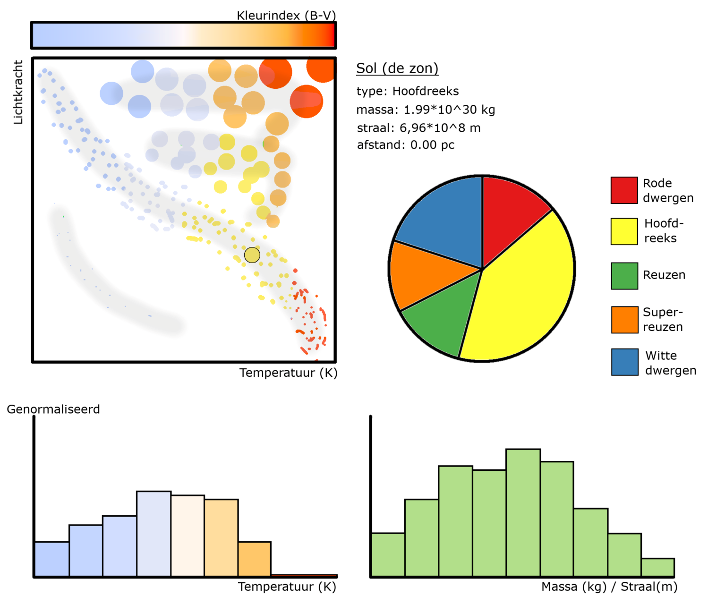

# Programmeerproject2019
# Project Proposal

## Problem statement

## Solution

### Schets work in progress

### Hertzsprung-Russell Diagram
Een Hertzsprung-Russell diagram (HR-diagram) is een scatterplot van sterren en hun absolute herlderheid en effectieve temperatuur. Het diagram kan ook worden veranderd in een bubble chart door de straal of massa van sterren te visualiseren als de oppervlakte van de stippen.
De effectieve temperatuur van een ster staat gelijk aan de bepaalde kleur (blauw -> wit -> geel -> rood).

### Histogram
In het histogram wordt de verdeling van de massa of de straal weergegeven aan de hand van hoeveel sterren er in de verschillende 'bins' passen.

### Piechart
In het taartdiagram wordt de verdeling van de type sterren weergegeven. In een HR-diagram zijn de sterren in 5 type te verdelen:
- Rode dwergen
- De hoofdreeks (main sequence)
- Reuzen
- Superreuzen
- Witte dwergen

## Prerequisites

### Dataset
Voor het project wordt er gebruik gemaakt van de [HYG-database](https://github.com/astronexus/HYG-Database) van David Nash. Deze database bevat bijna 120.000 sterren en is samengesteld uit verschillende catalogussen:
- Hipparcos Catalog
- Yale Bright Star Catalog (5th edition)
- Gliese Catalog of Nearby Stars (3rd edition)

### Externe componenten
Er zal gebruikt worden gemaakt van D3 versie 5 en de externe D3 library: [d3-tip](https://github.com/Caged/d3-tip)

### Similar
ESA: [Star Mapper](http://sci.esa.int/star_mapper/)
Google: [100,000 Stars](https://stars.chromeexperiments.com/)

### Moeilijkste onderdelen
- Bepalen type van elke ster
- Bepalen massa van sterren aan de hand van type en helderheid
- Efficiënt omgaan met 120.000 datapunten
- Alle selecties en updates goed laten werken
